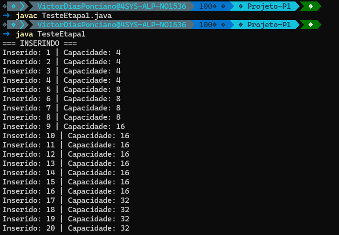
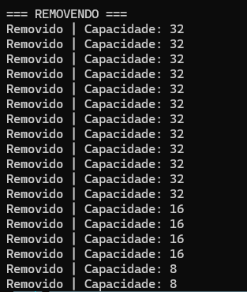

# PROJETO P1

> Autor: Victor Ponciano

Projeto realizado para estudo e complemento de nota da P1 (Primeira Avaliação) da disciplina de Estrutura de Dados da Fatec Carapicuiba.

> Professora Andréia Machion

## DESENVOLVIMENTO

O desenvolvimento do projeto foi dividio em etapas, onde cada etapa possuiu *"commits"* para indicar o avanço do projeto.

As etapas foram 3:
1. **Etapa 1 - Fundamentos da OO e Vetor Dinâmico**
2. **Etapa 2 - Pilha e Pilha com Desfazer**
3. **Etapa 3 - Pilha de Prioridade**

As etapas e o projeto utilizaram como referência códigos realizados em aula que foram retrabalhados para um melhor aproveitamento, como exemplo: `NossoVetor.Java`.

### ETAPA 1

Esta etapa conteve o desenvolvimento dos códigos:
- Processo.java
- VetorDinamico.java

A Etapa pedia um teste que dizia: "Crie um programa de teste que demonstre: inserção em massa até forçar ao menos dois redimensionamentos crescentes; remoção em massa até forçar ao menos um redimensionamento decrescente; impressão da capacidade atual do array a cada operação."

Seguem os logs dos testes realizados:

Inserção forçada até ao menos dois redimensionamentos.

Remoção em massa até forçar ao menos um redimensionamento descrescente.

> Nota: caso haja curiosidade de saber o motivo de o terminal estar estilizado, utilizo o tema "Oh My Posh" no Windows Terminal.

### ETAPA 2

A ser realizado

### ETAPA 3

A ser realizado
